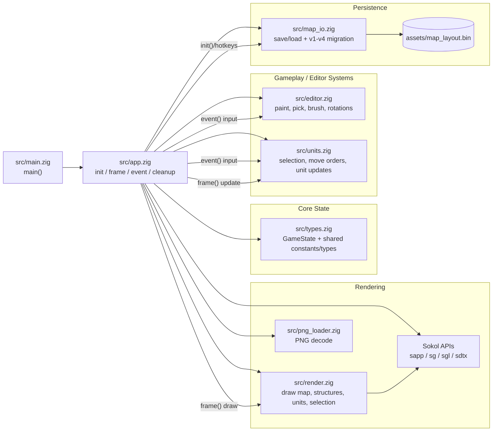

# Zig Isometric RTS Prototype

StarCraft/Warcraft-style control prototype in Zig using Sokol, with native and browser targets.

## Tools Used

- Zig `0.15.2` (build system + game code)
- Sokol (`sokol_app`, `sokol_gfx`, `sokol_gl`) for rendering/input/windowing
- Emscripten SDK (`emsdk`, `emcc`) for WebAssembly/WebGL builds
- `stb_image` for PNG loading
- Python `http.server` (or any static server) to run the web build locally

## Source Layout

- `src/main.zig`: minimal entrypoint
- `src/app.zig`: app lifecycle, gameplay/editor/render orchestration
- `src/types.zig`: shared constants and core data structures
- `src/map_io.zig`: map persistence and save-format migration logic
- `src/editor.zig`: editor paint/pick/brush shortcut logic
- `src/units.zig`: unit selection, movement orders, and update logic
- `src/render.zig`: world/layer/unit rendering helpers

## Architecture Overview



Quick read order for new devs:
- Start at `src/main.zig`, then read `src/app.zig` top-to-bottom.
- Use `src/types.zig` as the schema for shared game/editor/render state.
- Follow behavior by flow: `event()` -> `editor/units`, then `frame()` -> `units` update -> `render`.
- For save/load concerns, read `src/map_io.zig` (format versions and migration rules).

## Prerequisites

- Native:
  - Zig installed and available in `PATH`
- Web:
  - Emscripten installed (example path used in this project: `<path-to-emsdk>`)

## Emscripten Setup (Web Only)

Install `emsdk` once:

```bash
cd <workspace-root>
git clone https://github.com/emscripten-core/emsdk.git
cd emsdk
./emsdk install latest
./emsdk activate latest
```

Load Emscripten tools in your shell:

```bash
source <path-to-emsdk>/emsdk_env.sh
```

Optional: auto-load on new terminal sessions:

```bash
echo 'source "<path-to-emsdk>/emsdk_env.sh"' >> ~/.zprofile
```

Verify:

```bash
emcc --version
```

Why this is needed:
- native build (`zig build`, `zig build run`) does not need `emsdk`
- web build (`zig build web`) requires Emscripten, and this project expects:
  `-Demsdk=<path-to-emsdk>`

## Asset Setup

1. Buy/download tiles from:
   `https://screamingbrainstudios.itch.io/iso-town-pack`
2. Copy PNG files under:
   `assets/iso-town-pack/`
3. Optional override names (highest priority if present):
   - `ground.png`
   - `unit_blue.png`
   - `unit_red.png`

If missing, fallback generated sprites are used.

## Build and Run (Native)

From project root:

```bash
zig build
zig build run
```

## Build and Run (Web / WASM)

From project root:

```bash
zig build web -Demsdk=<path-to-emsdk>
```

Web output is generated in:
`zig-out/web/`

Run with a local static server:

```bash
cd zig-out/web
python3 -m http.server 8080
```

Open:
`http://localhost:8080`

## Controls

- `LMB` click: select unit
- `LMB` drag: box-select units
- `Shift + LMB`: additive selection
- `RMB`: issue move order
- `WASD` / Arrow keys: pan camera
- Mouse wheel: zoom in/out
- `Tab`: toggle level editor mode

### Editor Mode

- `LMB` drag: paint tiles as a brush
- `RMB`: pick tile from map
- `F` / `B` / `R`: switch layer (floor / wall / roof)
- `1..8`: choose brush tile variant for active layer
- `0`: clear tile (wall/roof layers)
- `X`: toggle erase mode for active layer
- `Alt + LMB`: temporary erase while painting
- `Q` / `E`: rotate wall/roof brush (0/90/180/270)
- `[` / `]`: decrease/increase brush size
- `Cmd/Ctrl + S`: save current painted map to `assets/map_layout.bin` (native build)
- `Cmd/Ctrl + L`: reload map from `assets/map_layout.bin` (native build)

On native builds, `assets/map_layout.bin` is auto-loaded on startup when present.
Map files are now saved as format `v4`; legacy `v1`, `v2`, and `v3` files are auto-migrated when loaded.
Save/load results now also appear as a short on-screen HUD message.
